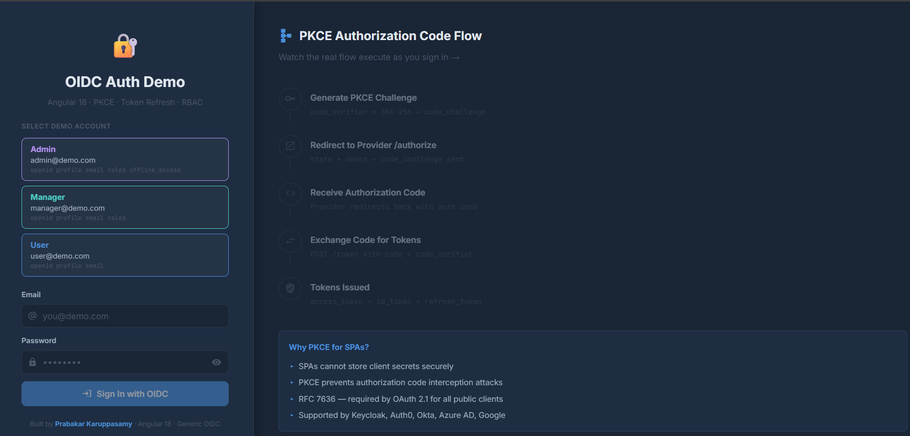
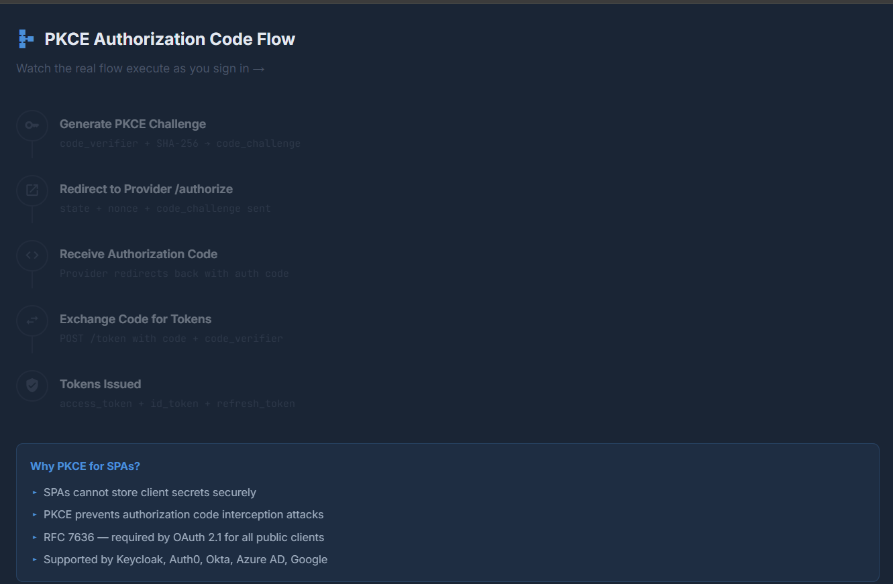
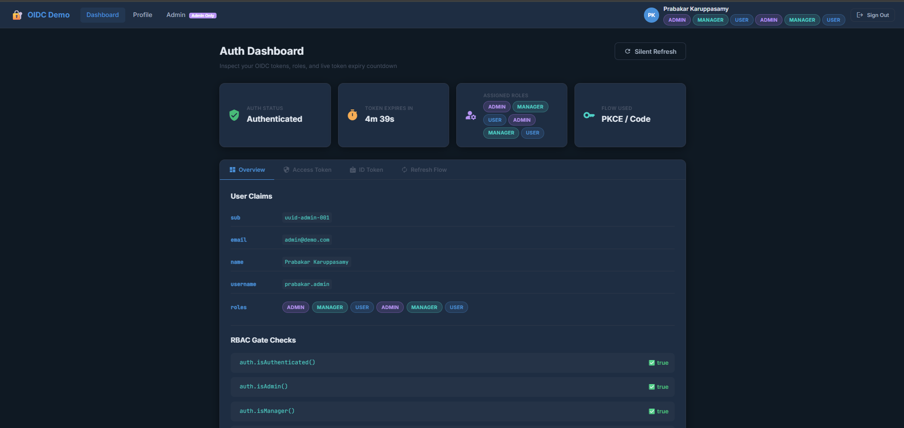
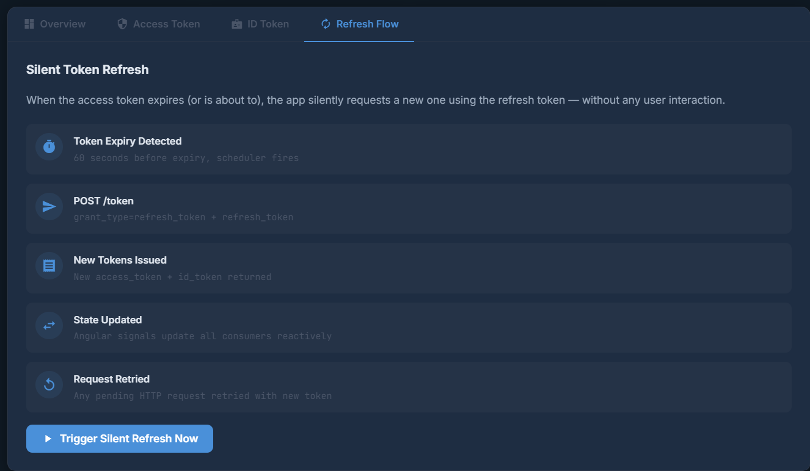

# 🔐 Angular OIDC Auth Demo

> **Production-ready OIDC authentication implementation** for Angular 18 — featuring the full PKCE Authorization Code Flow, silent token refresh, role-based access control (RBAC), functional route guards, and JWT inspection. Works with **any RFC-compliant OIDC provider**: Keycloak, Auth0, Okta, Azure AD, Google.

[](https://angular.dev)
[](https://typescriptlang.org)
[](https://openid.net/connect/)
[](https://tools.ietf.org/html/rfc7636)

---

## 🚀 Live Demo

**Demo Credentials:**
| Role    | Email                | Password     | Access Level |
|---------|----------------------|--------------|--------------|
| Admin   | admin@demo.com       | Admin@123    | All pages + Admin Panel |
| Manager | manager@demo.com     | Manager@123  | Dashboard + Manager content |
| User    | user@demo.com        | User@123     | Dashboard only |

---

## ✨ What This Demonstrates

### 🔑 PKCE Authorization Code Flow (RFC 7636 + RFC 6749)
- `crypto.getRandomValues()` — cryptographically secure `code_verifier` generation
- `crypto.subtle.digest('SHA-256')` — real SHA-256 hashing for `code_challenge`
- Base64URL encoding per RFC 4648 §5
- State parameter for CSRF protection
- Nonce for replay attack prevention
- Live PKCE flow visualizer — watch every step execute in real time

### 🔄 Silent Token Refresh
- Access token expiry countdown (live, updates every second)
- Proactive refresh — 60 seconds before expiry via `timer()` + RxJS
- Reactive refresh — auto-retry on HTTP 401 via functional interceptor
- Refresh token rotation support

### 🛡️ Role-Based Access Control (RBAC)
- Multi-role support — `admin`, `manager`, `user`
- Functional route guards — `authGuard`, `guestGuard`, `roleGuard('admin')`
- Conditional UI rendering via `auth.isAdmin()` / `auth.isManager()` signals
- `/admin` route hard-blocked for non-admins → redirects to `/unauthorized`

### 🧾 JWT Inspector
- Decode access token, ID token headers and payloads
- Live expiry countdown
- Role extraction — Keycloak `realm_access.roles`, Auth0 namespace claims, generic `roles` array

---

## 🏗️ Architecture

```
src/app/
├── core/
│   ├── models/
│   │   └── auth.models.ts          # All TypeScript interfaces — JwtPayload, AuthUser, AuthState...
│   ├── services/
│   │   ├── pkce.service.ts         # Real PKCE — SHA-256, Base64URL, state, nonce generation
│   │   ├── token.service.ts        # JWT decode, sessionStorage, token lifecycle
│   │   └── oidc-auth.service.ts    # Full OIDC flow engine — signals, refresh scheduler, RBAC
│   ├── guards/
│   │   └── auth.guard.ts           # authGuard, guestGuard, roleGuard (functional)
│   └── interceptors/
│       └── oidc.interceptor.ts     # Bearer token injection + 401 auto-refresh
├── features/
│   ├── auth/
│   │   ├── login/                  # Login + live PKCE flow visualizer
│   │   ├── callback/               # Handles OIDC provider redirect (production)
│   │   └── unauthorized/           # 403 page for role mismatches
│   ├── dashboard/                  # Token inspector, RBAC demo, role-gated content
│   ├── profile/                    # ID token claims, OIDC education
│   └── admin/                      # Admin-only, role guard demo with code display
└── environments/
    └── environment.ts              # OIDC provider config — swap to go live
```

---

## 🔐 Security Patterns Implemented

| Pattern | Implementation |
|---|---|
| PKCE (RFC 7636) | `PkceService` — Web Crypto API, SHA-256, Base64URL |
| CSRF Protection | Random `state` parameter, verified on callback |
| Replay Prevention | Random `nonce`, must match `id_token` claim |
| Token Storage | `sessionStorage` — cleared on tab close, not `localStorage` |
| Bearer Injection | Functional HTTP interceptor — automatic, consistent |
| Proactive Refresh | 60s-before-expiry scheduler via `timer()` |
| Reactive Refresh | Auto-retry on 401 in interceptor |
| Route Protection | Functional guards — `authGuard`, `roleGuard` |
| Token Validation | ⚠️ Client-side decode only — backend must verify JWKS signature |

---

## 🛠️ Getting Started

### Prerequisites
```bash
node --version   # 18+
npm install -g @angular/cli@18
```

### Run the Demo
```bash
cd angular-oidc-auth-demo
npm install
ng serve
# Navigate to http://localhost:4200
```

### Connect to a Real OIDC Provider

Edit `src/environments/environment.ts`:

```typescript
oidc: {
  issuer:                  'https://your-keycloak.com/realms/your-realm',
  clientId:                'your-angular-client',
  redirectUri:             'http://localhost:4200/auth/callback',
  postLogoutRedirectUri:   'http://localhost:4200/login',
  scope:                   'openid profile email roles offline_access',
  // ... token/auth/userinfo endpoints
}
```

Then in `OidcAuthService.initiateLogin()`, replace the mock simulation with:
```typescript
// Uncomment for real OIDC:
// window.location.href = this.buildAuthorizationUrl(pkce, state, nonce);
```

And in `CallbackComponent`, extract `code` and `state` from query params and call `exchangeCodeForTokens()`.

---


## 📸 Screenshots

### Login Screen

<p align="center">
  
</p>

---

### PKCE Code Authorization Flow

<p align="center">
  
</p>

---

### Admin Dashboard

<p align="center">
  
</p>

---

### Refresh Flow

<p align="center">
  
</p>


## 📚 References

- [OpenID Connect Core 1.0](https://openid.net/specs/openid-connect-core-1_0.html)
- [RFC 7636 — PKCE](https://tools.ietf.org/html/rfc7636)
- [RFC 6749 — OAuth 2.0](https://tools.ietf.org/html/rfc6749)
- [Angular Security Guide](https://angular.dev/best-practices/security)
- [OAuth 2.0 for Browser-Based Apps](https://datatracker.ietf.org/doc/html/draft-ietf-oauth-browser-based-apps)

---

## 👤 Author

**Prabakar Karuppasamy** — Frontend Architect & Technical Lead  
14+ years implementing enterprise SSO and OIDC in banking applications at BNP Paribas and Bank of America.

[](https://linkedin.com/in/prabakarsamy)
[](https://github.com/PrabakarKaruppasamy)

> ⭐ Star this repo if it helped you understand OIDC in Angular!
